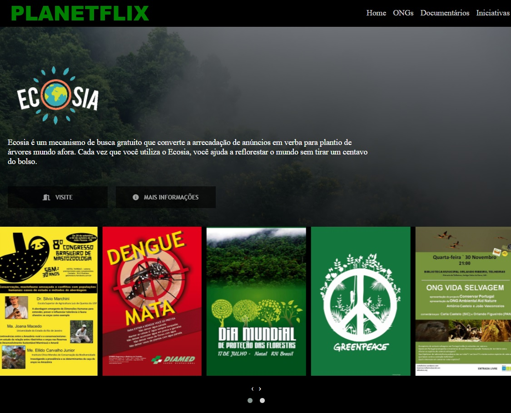

# PLANET FLIX (Projeto Estilo Netflix)
Repositório para Projeto Estilo Netflix proposto no Bootcamp da Inter (via DIO)  
Para utilizar um tema original no projeto, descidi criar o protótipo do que seria um site chamado 'planetflix' para divulgação de ongs, iniciativas e materiais (documentários, etc) associados de alguma maneira ao meio ambiente.    

## Coisas que Aprendi com o Projeto

- O uso de asterisco no CSS permite definir padrões para todo o documento.
- A criação de variáveis em :root permite acessá-las posteriormente de outros locais no documento.
- Descobri a existência do "Font Awesome".
- Utilização do Owl Carousel.
- A utilização de @media pra criação de um .CSS responsivo.    

## Desafios Propostos Realizados

- Dada nova roupagem ao site.
- Botão "visite" redirecionando para site do Ecosia, e botão "Mais Informações" direcionando ao artigo Wikipedia do Ecosia.
- Como os demais posteres são 'placeholders' utilizando em sua maioria divulgações de eventos e campanhas finalizadas, não foram feitas mais adições.  

## O Resultado Final

