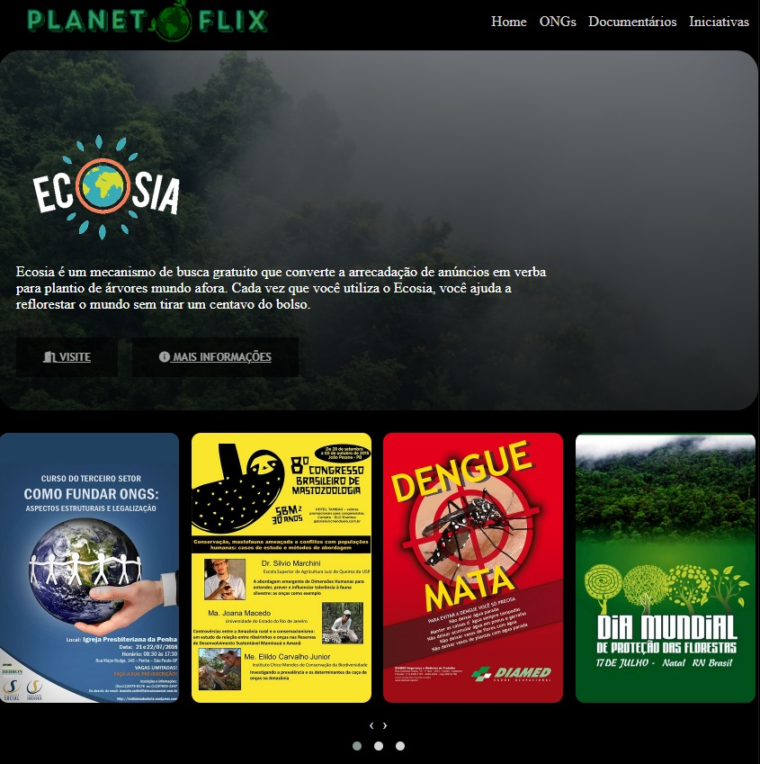

# Projeto_Estilo_Netflix
Repositório para Projeto Estilo Netflix proposto no Bootcamp da Inter (via DIO)  
Para utilizar um tema original no projeto, descidi criar o protótipo do que seria um site chamado 'planetflix' para divulgação de ongs, iniciativas e materiais (documentários, etc) associados de alguma maneira ao meio ambiente.

Coisas que aprendi e que não sabia fazendo esse projeto: 

- O uso de asterisco no CSS permite definir padrões para todo o documento.
- A criação de variáveis em :root permite acessá-las posteriormente de outros locais no documento.
- Descobri a existência do "Font Awesome".
- Utilização do Owl Carousel.

